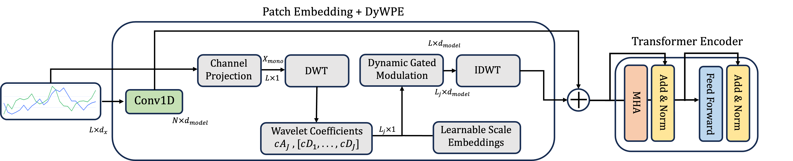

# DyWPE: Dynamic Wavelet Positional Encoding

[](https://www.python.org/downloads/release/python-380/)
[](https://pytorch.org/)
[](https://opensource.org/licenses/MIT)

## Description

Dynamic Wavelet Positional Encoding (DyWPE) introduces a new paradigm: a signal-aware PE framework. Instead of relying on abstract indices, DyWPE generates positional embeddings directly from the input time series signal. By leveraging the Discrete Wavelet Transform (DWT), DyWPE captures time-frequency information, creating a rich positional representation that is dynamically adapted to the signal's local behavior. This allows the model to distinguish between, for example, a quiet, stable period and a volatile, high-frequency period, even if they occur at the same absolute positions in different samples.

<p align="center">
  
</p>

## Key Features

- **Signal-Aware**: First positional encoding that adapts to signal content
- **Multi-Scale**: Captures hierarchical temporal patterns via wavelet decomposition  
- **Non-Stationary Ready**: Inherently handles time-varying signal characteristics
- **Efficient**: Linear $\mathcal{O}(L)$ complexity for sequence length L
- **Comprehensive Ablations**: Rigorous validation of core claims

## Installation

```bash
git clone https://github.com/imics-lab/dywpe.git
cd dywpe
pip install -r requirements.txt
```

### Dependencies

```
torch>=1.9.0
numpy>=1.20.0
pandas>=1.3.0
matplotlib>=3.4.0
scikit-learn>=1.0.0
```

## Usage

```python
from dywpe.ablation.benchmark import PositionalEncodingBenchmark

benchmark = PositionalEncodingBenchmark()

model_params = {
    'input_timesteps': input_timesteps,
    'in_channels': in_channels,
    'patch_size': patch_size,
    'embedding_dim': 32,
    'num_transformer_layers': 4,
    'num_heads': 4,
    'dim_feedforward': 128,
    'dropout': 0.2,
    'num_classes': num_classes
}

# Run benchmark
models = benchmark.run_full_benchmark(
    model_params,
    train_loader,
    valid_loader,
    test_loader,
    encodings=['dywpe'],
    n_epochs=50
)

benchmark.print_summary()
benchmark.plot_comparison('results.png')

```


## Ablation Studies

This repository includes the two critical ablation studies that validate DyWPE's core contributions:

### 1. Signal-Awareness Study

**Question**: Is signal-awareness (`P = f(x, θ)`) better than static approaches (`P = f(θ)`)?

```python
from dywpe.ablation import run_signal_awareness_ablation

results = run_signal_awareness_ablation(
    dataset_name='your_dataset',
    model_params=model_params,
    pe_params=pe_params,
    train_loader=train_loader,
    valid_loader=valid_loader,
    test_loader=test_loader,
    num_epochs=num_epochs
)
```

**Compares**:
- **DyWPE**: Full signal-aware approach
- **Static Wavelet PE**: Same multi-scale framework, no signal dependency

### 2. Multi-Scale Study

**Question**: Is hierarchical wavelet decomposition essential?

```python
from dywpe.ablation import run_multiscale_ablation

results = run_multiscale_ablation(
    dataset_name='your_dataset',
    model_params=model_params,
    pe_params=pe_params,
    train_loader=train_loader,
    valid_loader=valid_loader,
    test_loader=test_loader,
    num_epochs=50
)
```

**Compares**:
- **DyWPE (Multi-Scale)**: Full hierarchical decomposition
- **Single-Scale DyWPE**: J=1 decomposition only
- **Gated Conv PE**: Alternative single-scale approach

### Run All Ablations

```bash
# Run both core ablation studies
python experiments/run_ablation_studies.py --study both --dataset your_data --epochs 50

# Run signal-awareness study only
python experiments/run_ablation_studies.py --study signal_awareness --dataset your_data --epochs 50

# Run multi-scale study only  
python experiments/run_ablation_studies.py --study multiscale --dataset your_data --epochs 50
```

## Repository Structure

```
dywpe/
├── src/
│   ├── core/
│   │   └── dywpe.py              # DyWPE implementation
│   ├── models/
│   │   ├── embeddings.py         # Patch embedding module
│   │   └── transformer.py        # Modular transformer  
│   ├── ablation/
│   │   ├── benchmark.py          # PositionalEncodingBenchmark class
│   │   ├── signal_awareness.py   # Core ablation studies
│   │   └── multiscale.py         # Multi-scale ablation
│   └── __init__.py               # Imports PositionalEncodingBenchmark
├── examples/
│   └── run_benchmark_example.py  # Matches your usage exactly
└── README.md                     # Clean, copy-paste ready
```

## Complete Example

See `examples/complete_example.py` for a comprehensive tutorial that demonstrates:

- Basic DyWPE usage
- Running ablation studies
- Interpreting results
- Best practices

```bash
python examples/complete_example.py
```

## Methodology

### Core Innovation: Signal-Awareness

Traditional positional encodings compute `P = f(θ)` using only position indices. DyWPE computes `P = f(x, θ)` by:

1. **Multi-level DWT**: Decompose input signal into multiple temporal scales
2. **Gated Modulation**: Use signal coefficients to modulate learnable scale embeddings
3. **IDWT Reconstruction**: Synthesize final positional encoding

### Mathematical Framework

For input `x ∈ ℝ^(B×L×d_x)`:

1. **Channel Projection**: `x_mono = x · w_channel`
2. **Multi-Level DWT**: `(cA_J, [cD_J, ..., cD_1]) = DWT(x_mono)`
3. **Gated Modulation**: `modulated_coeffs = gate(scale_embeddings, coeffs)`
4. **IDWT Synthesis**: `P_DyWPE = IDWT(modulated_coeffs)`


### Parameter Guidelines

- **max_level**: Should be ≤ log₂(sequence_length) - 2
- **wavelet**: 'db4, db2.2' work well for most applications
- **embedding_dim**: Scale with sequence complexity
- **patch_size**: Typically 8-16 for time series


## Contributing

Pull requests are welcome. For major changes, please open an issue first to discuss what you would like to change.

Please make sure to update tests as appropriate.

## License

This project is licensed under the MIT License - see the [LICENSE](LICENSE) file for details.


## Citation

```bibtex
TBD
```

