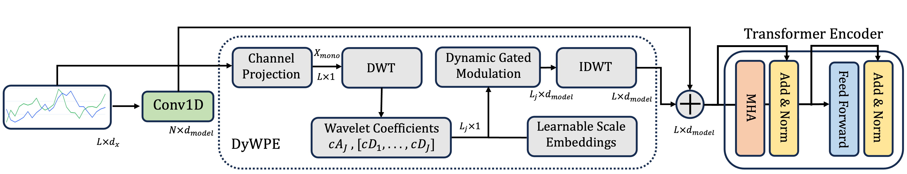

## Dynamic Wavelet Position Encoding (DyWPE) for Time Series Transformers

[](https://www.python.org/downloads/release/python-380/)
[](https://pytorch.org/)
[](https://opensource.org/licenses/MIT)
[](https://cmsworkshops.com/ICASSP2026/papers/accepted_papers.php)
[](https://arxiv.org/abs/2509.14640)

#### **News:** This work has been accepted for publication in [ICASSP 2026](https://2026.ieeeicassp.org/).

This is a PyTorch implementation of "DyWPE: Signal-Aware Dynamic Wavelet Positional Encoding for Time Series Transformers"

<p align="center">
  
</p>

### Overview

Dynamic Wavelet Positional Encoding (DyWPE) introduces a new paradigm: a signal-aware PE framework. Instead of relying on abstract indices, DyWPE generates positional embeddings directly from the input time series signal. By leveraging the Discrete Wavelet Transform (DWT), DyWPE captures time-frequency information, creating a rich positional representation that is dynamically adapted to the signal's local behavior. This allows the model to distinguish between, for example, a quiet, stable period and a volatile, high-frequency period, even if they occur at the same absolute positions in different samples.


### Methodology

#### Core Innovation: Signal-Awareness

Traditional positional encodings compute `P = f(θ)` using only position indices. DyWPE computes `P = f(x, θ)` by:

1. **Multi-level DWT**: Decompose input signal into multiple temporal scales
2. **Gated Modulation**: Use signal coefficients to modulate learnable scale embeddings
3. **IDWT Reconstruction**: Synthesize final positional encoding

#### Mathematical Framework

For input `x ∈ ℝ^(B×L×d_x)`:

1. **Channel Projection**: `x_mono = x · w_channel`
2. **Multi-Level DWT**: `(cA_J, [cD_J, ..., cD_1]) = DWT(x_mono)`
3. **Gated Modulation**: `modulated_coeffs = gate(scale_embeddings, coeffs)`
4. **IDWT Synthesis**: `P_DyWPE = IDWT(modulated_coeffs)`


#### Parameter Guidelines

- **max_level**: Should be ≤ log₂(sequence_length) - 2
- **wavelet**: 'db4', 'bior2.2' work well for most applications
- **embedding_dim**: Scale with sequence complexity


### Installation

```bash
git clone https://github.com/imics-lab/DyWPE.git
cd DyWPE
pip install -r requirements.txt
```

#### Dependencies

```
torch>=1.9.0
numpy>=1.20.0
pandas>=1.3.0
matplotlib>=3.4.0
scikit-learn>=1.0.0
pytorch_wavelets>=1.3.0
```

#### Repository Structure

```
dywpe/
├── src/
│   ├── core/
│   │   └── dywpe.py              # DyWPE implementation
│   │   └── position_encodings.py # Other PEs implementation
│   ├── models/
│   │   ├── embeddings.py         # Patch embedding module
│   │   └── transformer.py        # Time Series transformer  
│   ├── ablation/
│   │   ├── benchmark.py          # PositionalEncodingBenchmark class
│   │   ├── signal_awareness.py   # Core ablation studies
│   │   └── multiscale.py         # Multi-scale ablation
│   │   ├── complete_ablation.py  # complete ablation studies
│   └── __init__.py               
├── scripts/
│   └── run_benchmark_example.py  
│   └── run_ablation_studies.py  
│   └── complete_example.py  
└── README.md                 
```

#### Core Components

```python
class DyWPE(nn.Module):
    def __init__(self, d_model, d_x, max_level, wavelet='db4'):
        super().__init__()
        
        # Professional wavelet transforms
        self.dwt = DWT1D(wave=wavelet, J=max_level, mode='symmetric')
        self.idwt = IDWT1D(wave=wavelet, mode='symmetric')
        
        # Learnable components
        self.channel_proj = nn.Linear(d_x, 1)
        self.scale_embeddings = nn.Parameter(torch.randn(max_level + 1, d_model))
        self.gate_w_g = nn.Linear(d_model, d_model)
        self.gate_w_v = nn.Linear(d_model, d_model)
```

### Usage

#### Usage as Embedding Layer Approach
```python
from core.dywpe import DyWPE

class TimeSeriesEmbeddingWithDyWPE(nn.Module):
    """
    Drop-in replacement for standard embedding layers in time series transformers.
    Combines input projection with DyWPE position encoding.
    """
    def __init__(self, input_dim, d_model, max_length, max_level, wavelet='db4'):
        super().__init__()
        # Input feature projection
        self.input_proj = nn.Linear(input_dim, d_model)
        
        # DyWPE positional encoding
        self.pos_encoder = DyWPE(
            d_model=d_model,
            d_x=d_model,        # Use d_model for embedded tokens
            max_level=max_level,
            wavelet=wavelet
        )
        
    def forward(self, x):
        """
        Args:
            x: Time series input (batch_size, seq_length, input_dim)
        Returns:
            Embedded and positionally encoded features (batch_size, seq_length, d_model)
        """
        # Project input features
        x = self.input_proj(x)  # (batch, seq_len, d_model)
        
        # Apply DyWPE positional encoding
        x = self.pos_encoder(x)  # (batch, seq_len, d_model)
        
        return x

# Usage in any transformer architecture
embedding_layer = TimeSeriesEmbeddingWithDyWPE(
    input_dim=INPUT_CHANNELS,    # Number of time series features
    d_model=D_MODEL,             # Model embedding dimension
    max_length=SEQ_LENGTH,       # Maximum sequence length
    max_level=MAX_LEVEL,         # Wavelet decomposition levels
    wavelet='db4'                # Wavelet type ('haar', 'db4', 'db8', 'coif2', etc.)
)

# Test the embedding layer
time_series = torch.randn(BATCH_SIZE, SEQ_LENGTH, INPUT_CHANNELS)  # (batch, sequence, features)
embedded = embedding_layer(time_series)

# Now you can pass 'embedded' to any standard transformer encoder
```


#### Usage in PatchTST
```python
from core.dywpe import DyWPE
from models.transformer import TimeSeriesTransformer

# Initialize DyWPE 
pos_encoder = DyWPE(
            d_model=D_MODEL,         
            d_x=INPUT_CHANNELS,      # Number of input channels
            max_level=MAX_LEVEL,     # Wavelet decomposition levels  # log2(SEQ_LENGTH) = x . Can go up to x .
            wavelet='db4'            # Wavelet type ('haar', 'db4', 'db8', 'coif2', etc.)
        )

# Use in transformer
model = TimeSeriesTransformer(
        input_timesteps= SEQ_LENGTH,         # Sequence length
        in_channels= INPUT_CHANNELS,         # Number of input channels
        patch_size=PATCH_SIZE,               # Patch size for embedding
        embedding_dim=EMBED_DIM.             # Embedding dimension
        num_transformer_layers=NUM_LAYERS,   # Number of transformer layers (4, 8, etc.)
        num_heads=N_HEADS,                   # Number of attention heads
        num_layers=NUM_LAYERS,               # Number of transformer layers
        dim_feedforward=DIM_FF,              # Feedforward dimension
        dropout=DROPOUT,                     # Dropout rate (0.1, 0.2, etc.)
        num_classes= NUM_CLASSES             # Number of output classes
        pos_encoding='dywpe',                # Positional encoding type
    )

# Forward pass
x = torch.randn(BATCH_SIZE, SEQ_LENGTH, INPUT_CHANNELS)  # (batch, sequence, features)
output = model(x)
```

### Results

Our comprehensive evaluation across 10 diverse time series datasets demonstrates DyWPE's superior performance compared to state-of-the-art positional encoding methods.

#### Performance Overview

<p align="center">
  
  
  <br>
  <em><strong>Left:</strong> Distribution of z-score normalized classification accuracy across 10 datasets. DyWPE shows the highest median performance and most consistent results. 
  <strong>Right:</strong> Trade-off between accuracy improvement and computational overhead. DyWPE achieves strong gains with competitive O(L) complexity.</em>
</p>

For detailed experimental results and ablation studies, please refer to our [paper](https://arxiv.org/abs/2509.14640).


### Contributing

Pull requests are welcome. For major changes, please open an issue first to discuss what you would like to change.

Please make sure to update tests as appropriate.

### License

This project is licensed under the MIT License - see the [LICENSE](LICENSE) file for details.


### Citation

If you find **DyWPE** useful for your research, please consider citing this paper using the following information:

```bibtex
@inproceedings{irani2026dywpe,
  title={DyWPE: Signal-Aware Dynamic Wavelet Positional Encoding for Time Series Transformers},
  author={Irani, Habib and Metsis, Vangelis},
  booktitle={IEEE International Conference on Acoustics, Speech and Signal Processing (ICASSP)},
  year={2026},
  organization={IEEE}
}
```

